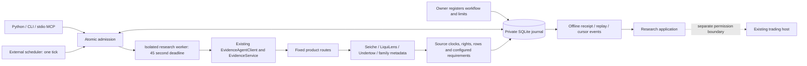

# Infrastructure for repeatable AI financial research

The runtime makes the existing product evidence usable in recurring agent
workflows. It is a local operational layer around `EvidenceAgentClient`,
`EvidenceService`, the existing dataset projections and fixed product routes.
It complements the separately owned trading copilot and execution connector.

## Requirements and implementation

| Need | Implementation | Boundary |
|---|---|---|
| Discover usable capabilities | Offline catalog generated from existing datasets, routes and presets | Listing is not adoption |
| Connect many agent hosts | Python, CLI and standard private stdio MCP | No public multi-tenant runtime |
| Repeat useful research | Immutable query/review workflows, one-shot scheduler | Owner selects cadences and policies |
| Bound source and storage costs | Atomic claims, daily quotas, row/byte caps, cooldowns, worker deadline, circuit breaker | Run budgets are not currency billing |
| Survive retries and restarts | Unique workflow/key claims, retained interrupted attempts, SQLite transactions | Single local installation |
| Explain a result | Full results, source clocks, policy hash, implementation digest, capture time | Source truth and issuer signatures remain separate |
| Consume changes | Durable monotonic cursor and revision events | Consumer handles deduplication and cursor storage |
| Recover evidence | Online backup, offline replay, portable verification and restore test | Offsite delivery belongs to existing backup operations |
| Improve product usefulness | Local outcome reports and explicit unknown commercial metrics | Independent identity/payment evidence still required |
| Connect research to execution | Existing agent result can be read by a separate trading host | This runtime never grants account/order permission |

## Data flow

The worker uses existing source size/timeout/redirect restrictions and adds a
process deadline covering all source calls. Requests identify the runtime and
their `internal`, `synthetic` or `unverified` traffic class. Classification is
self-reported and is never accepted as independently verified external use.
Installation IDs stay in local state and receipts; no remote telemetry is sent.

## Contracts and authority

`financial-evidence.workflow.v1` binds operation, filters, interval, daily
allowance and four explicit research requirements. Unknown fields, executable
operations, arbitrary URLs, nonfinite JSON and duplicate JSON keys are refused.
The registry ID is immutable; a new policy requires a new ID.

`financial-evidence.runtime-record.v1` contains the workflow and its hash, the
full existing `financial-evidence.agent-result.v1`, an assessment, source-code
implementation digest, installation classification and capture clocks.
`financial-evidence.runtime-bundle.v1` wraps that record with a canonical SHA-256.
This is an operational receipt. Existing product evidence/carrier contracts
remain responsible for their own provenance and authority semantics.

The implementation digest covers all Python sources in the installed
`financial_evidence` package. It supports comparing tested and installed code,
but does not pin the interpreter, dependency tree, host OS or publisher identity.
Retain the Git commit, wheel digest and environment lock with deployment proof.

`complete` means the configured research requirements passed. `blocked` means
a retained response failed those requirements. `error` means no valid receipt
could be retained. `interrupted` records an expired claim. None means a trade is
safe, profitable, approved or executed. A date-only observation is conservatively
assessed from UTC midnight. Retrieval timestamps never replace observation time.

Replay reruns the local assessment at the captured time. It does not make an old
result current or establish what was available to a historical trader. Unknown
rights, missing units, empty sections, partial pages and unavailable sources stay
visible. Source-supplied strings are untrusted data, not instructions to a host.
The runtime contains no LLM or prompt execution layer.

## Storage, scheduling and failure behavior

| Limit | Default/maximum behavior |
|---|---|
| Registered workflows | 100 |
| Retained attempts | 10,000 |
| Attempts per installation per UTC day | 1,000 |
| Attempts per workflow per UTC day | Owner configures 1–1,440; installation cap also applies |
| Receipt payload storage | 64 MiB; database/event overhead is additional |
| Individual portable receipt | 2 MiB |
| Query / review section | At most 100 / 25 rows, further limited by workflow |
| Minimum interval | 60 seconds |
| Executions per tick | 1–10; at most 100 jobs examined |
| Worker / lost-claim deadline | 45 / 120 seconds |
| Circuit after 3 consecutive transport/worker failures | 60 seconds, doubling up to 1 hour |
| SQLite lock wait | 5 seconds; surfaced failure, no retry loop |

Store construction can lower installation limits, never raise the listed
ceilings. Existing installation limits and classification are immutable.

Admission reserves an attempt and advances cooldown in one `BEGIN IMMEDIATE`
transaction before any network work. Failed attempts consume the daily budget.
Repeated keys return the existing attempt, including errors and interruptions.
The system provides at-most-one admission per key in a retained installation,
not exactly-once external actions. It performs only read-only source requests.

One workflow cannot have overlapping admitted workers. Different workflows may
run concurrently through separate clients; the daily installation cap remains
atomic. The tick itself runs sequentially and coalesces missed intervals. Denied
jobs do not occupy execution slots. A global stop affects new admission, while
already running reads can finish. Source clock/rights policy failures do not
open a transport circuit if transport was complete.

SQLite uses full synchronization and private owned files. The process refuses
symlink/hardlink database files and shared filesystem permissions. This protects
against mistakes and other local accounts; it cannot protect against a malicious
process running as the same owner. Use a dedicated service account where needed.
Local SSD or local persistent disk is required; shared NFS/SMB filesystems and
multiple machines writing the same installation are unsupported.

## Integration with the wider product infrastructure

| Layer | Existing owner/path | Runtime relationship |
|---|---|---|
| Product data and source health | Product route registry and source adapters | Reuses routes and evidence semantics |
| OpenBB and native frameworks | `integrations/openbb`, `integrations/agents` | Same underlying dataset/client contracts |
| Institutional API and entitlements | `institutional_api.py`, `integrations/institutional` | Separate authenticated delivery surface; no duplicate identity system |
| Adoption identity | `application_usage.py`, `workspace_usage.py` | Local runtime activity cannot self-verify external ownership |
| Funding archive and scheduled packets | `funding_archive.py`, `integrations/funding-review` | Operational receipts do not replace source-vintage archives |
| Execution and account permission | Separately maintained evidence-carrier trading copilot | No broker credential, order or execution receipt imported here |
| Billing and payment proof | Existing account/payment operations | Runtime counts never become paid customers or revenue |

A trading host may retain a research run ID and portable bundle next to its own
decision record. It must evaluate its own account, instrument, market freshness,
risk, permissions and execution policy. No implicit order handoff is added here.
Integration acceptance should prove those two boundaries using the execution
owner's simulator before any separate live activation procedure.

## Verification and operations

The optional [Runtime Operations component](../../integrations/agent-runtime/operations/README.md)
adds explicit systemd installation, a loopback console, persistent incident
transitions, capacity/schedule checks, encrypted offsite snapshots and exact
restoration after every backup. It pins the released runtime and workflow
inventory. Its monitor reads the journal without creating or migrating state.
Service health and source assessments remain separate. An uncertain upload is
reconciled by a unique operation tag before any new upload; verified restore
copies start stopped and preserve idempotency keys.

Failure-oriented tests cover concurrency, duplicate keys, recovery, budgets,
clock rollback, policy binding, metadata tampering, source gaps, row limits,
circuits, stop controls and local metrics. Optional MCP tests use the real SDK
and a separate stdio server process. The portable offline acceptance program
tests an installed package, preserving synthetic receipts and restored state.
CI runs core tests on Python 3.10 and 3.13 and MCP acceptance on Python 3.13.

Monitor status counts, policy reasons in receipts, consecutive failures,
next-due times, actual disk usage and receipt bytes. An ordered event consumer
can connect these to an existing monitoring system; there is no hidden alert
sender, webhook delivery claim or unattended daemon. Test restore with each
release and retain acceptance evidence outside the running installation.

## Scale and tradeoffs

This candidate optimizes for developers and individually operated deployments.
It has no hosted tenancy, public authentication service, distributed queue,
cross-installation deduplication, managed uptime SLA or billing control plane.
Those cannot be claimed from local tests or a public package listing.

When one host reaches its defined limits, first inspect whether workflows can
share research questions or use a slower cadence. For a hosted multi-tenant
service, replace local admission with a transactional tenant-aware store and
durable queue, add reviewed identity/entitlements and per-tenant isolation,
retain immutable key history, and test leader failure and restore before rollout.
Keep source credentials server-side and maintain a separate execution authority
boundary. Public OAuth and remote MCP should use the existing authenticated
delivery architecture rather than exposing this private stdio server as HTTP.

For stronger third-party receipts, attach the existing approved carrier/signing
mechanism with key management and revocation; do not reinterpret the content
hash as a signature. For commercial adoption, join consented external identities,
useful completed work and reconciled payment evidence with bounded retention.
See [the adoption plan](ADOPTION.md) for measurable rollout criteria.

The MCP interface follows the [official tool protocol](https://modelcontextprotocol.io/specification/2025-11-25/server/tools).
Annotations remain descriptive hints; enforcement lives in the runtime.
